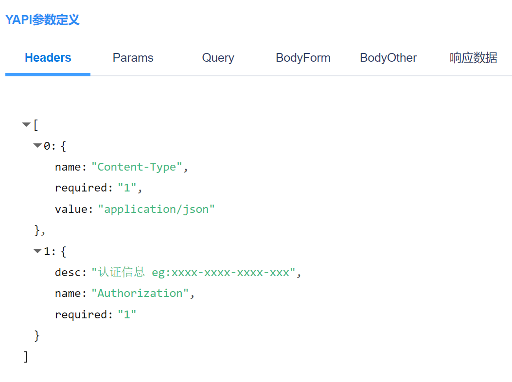
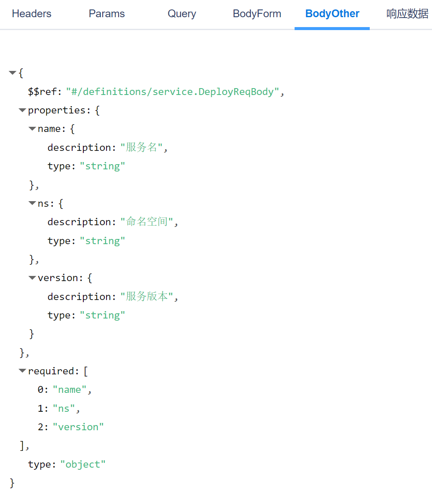
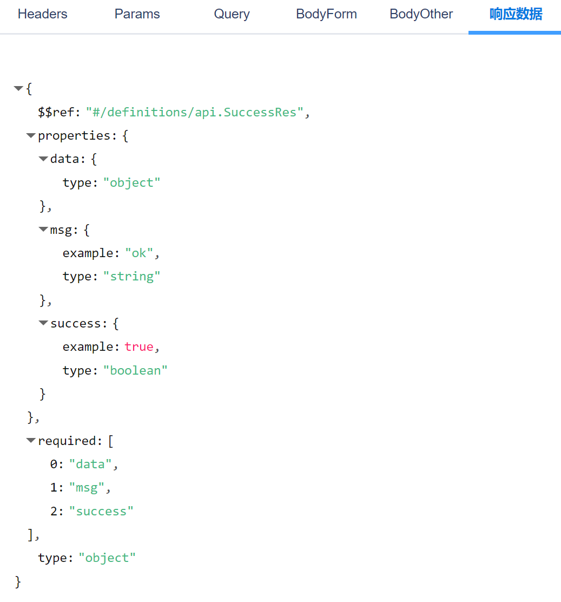
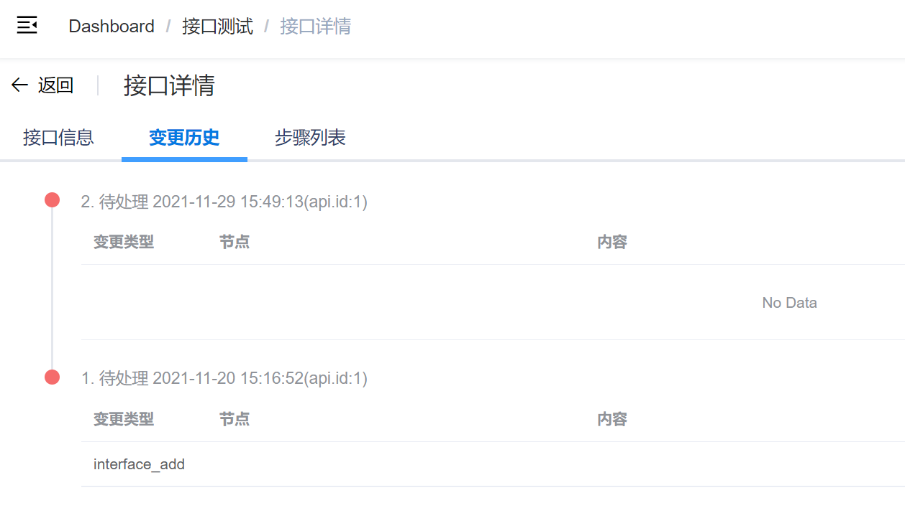
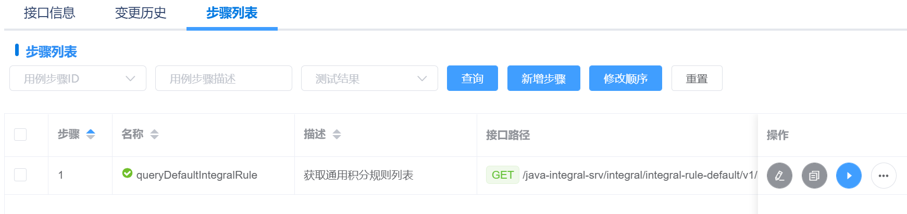

# 接口详情
接口列表->点击接口名称进入接口详情。

接口详情主要包含接口的基本信息、YAPI参数定义、用例模板、变更历史、关联测试步骤列表、用例模板推送到步骤等功能。

## 接口信息
包含状态、方法、路径、分组、描述等基础信息。

## YAPI参数定义
从YAPI爬取到的原始数据定义，供用例设计参考，包含Headers、Params、Query、BodyForm、BodyOther、响应数据。

### Headers

### BodyOther

### 响应数据

## 用例模板
包含Header、Body（query、json、data）、期望输出，全为JSON格式数据。可手动修改。

## 变更历史
以时间线模式显示接口变更历史，包含时间、事件、变更diff

## 步骤列表
显示该接口关联的测试步骤列表，页面同 **用例管理->步骤列表**
