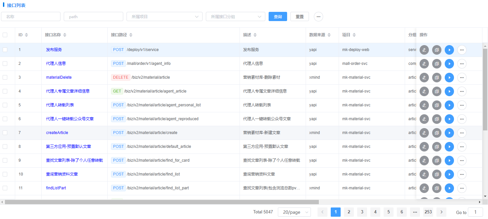
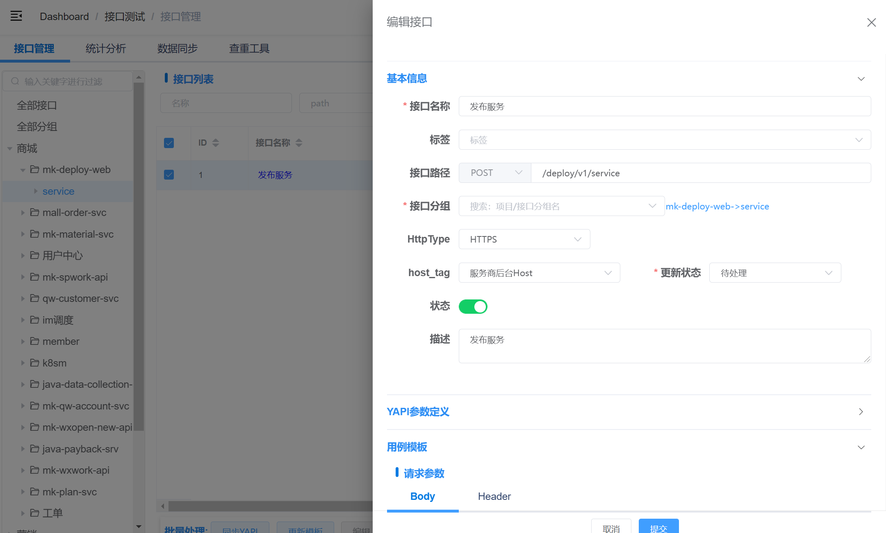
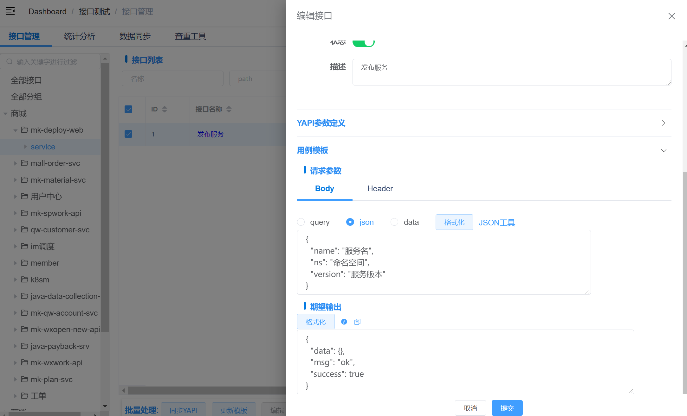

# 接口管理操作
接口管理默认页面，数据管理：更新、维护、主动同步YAPI、批量处理等。

## 左侧侧边栏
1. 全部接口：点击后右侧显示数据库中所有接口列表
2. 全部分组：点击后右侧显示数据库中所有接口分组列表
3. 部门->项目：点击后显示属于该项目的接口列表
4. 部门->项目->分组：点击后显示属于该接口分组的接口列表
5. 部门->项目->分组->接口：点击后显示接口详情

## 接口 - 列表
1. 显示满足条件查询的接口列表信息。
2. 左侧选择框可多选、全选 -> **批量处理： 同步YAPI、更新模板、编辑、启用、禁用、删除**
3. 接口名称：链接，跳转路由到 **接口详情-**

## 接口 - 新增/编辑
> 接口名称
> 
> 标签：选择全局配置中设置的一个标签
> 
> 接口路径： method + path，必填
> 
> 接口分组：设置所属分组
> 
> HttpType： 暂时未使用
> 
> host_tag：选择接口请求使用选中环境中对应的服务器地址（一个环境中有多个地址），
> 如：服务商后台host、企微host、计费Host
> 
> 更新状态： 默认待处理。 待处理（需要设计用例），待验证（需要执行用例验证），已处理（不写操作）
> 待处理、待验证会在统计分析的**接口更新**中体现。
> 
> 用例模板: 设置接口请求参数模板、期望输出模板，类型为JSON格式字符串

::: warning 注意：
**用例模板**数据设置需要是JSON格式字符串，必须JSON格式校验通过
:::

## 接口 - 复制
选中当前接口**复制接口**按钮，复制当前接口数据为一条新接口，需手动选中所属分组。

## 接口 - 同步YAPI
根据当前接口YAPI ID，拉取yapi最新数据进行同步更新，如果当前接口无yapi_id，忽略。

## 接口 - 更新模板
根据当前接口的**YAPI参数定义**，解析生成用例模板。

## 接口 - 启用/禁用
接口status设置，禁用后，对应测试关联的测试步骤不执行。

## 接口 - 删除
1. 软删除
2. 接口无关联测试步骤，直接软删除
3. 接口存在关联测试步骤，设置对应步骤状态为**禁用**，再软删除接口

## 批量处理
同上，一次性批量处理多条数据。

## 顶部工具栏 - 同步YAPI
主动拉取YAPI、同步数据库表中所有接口数据信息。

## 顶部工具栏 - 同步YAPI
更新数据库表中所有接口用例模板信息。
