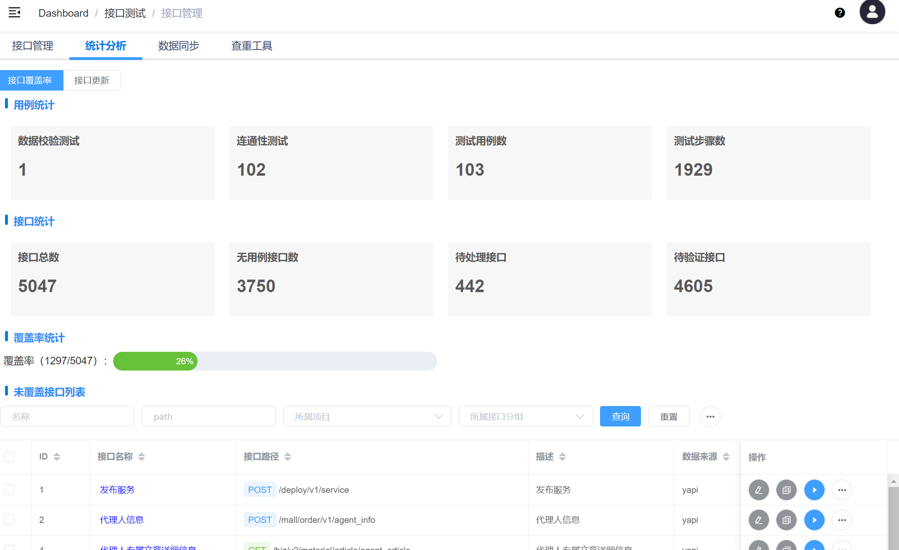
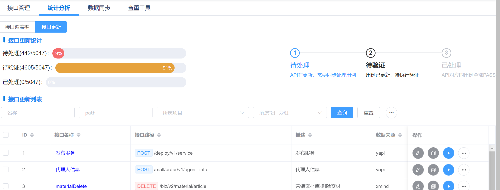

# 统计分析
接口统计分析，主要包含：
1. 接口覆盖率的统计、接口覆盖分析
2. 接口更新状态分析：待处理、待验证、已处理

## 接口覆盖率
1. 用例统计
   - 用例数
   - 步骤数
   - 测试类型统计：单接口测试用例数、场景测试数、性能测试用例数...
2. 接口统计
   - 接口总数
   - 无用例接口数
   - 更新待处理接口
   - 更新待验证接口
3. 覆盖率统计
4. 未覆盖接口列表
列表显示当前无测试用例的接口，页面同 **接口管理->接口列表**，方便针对接口精准设计测试用例，快速提高覆盖率。

## 接口更新
1. 接口更新统计
   - 待处理: 接口有变更后，需要更新对应测试步骤。
   - 待验证：测试步骤修改后，需要执行测试验证正确性
   - 已处理：验证通过。
2. 接口更新列表
待处理、待验证的接口列表。

