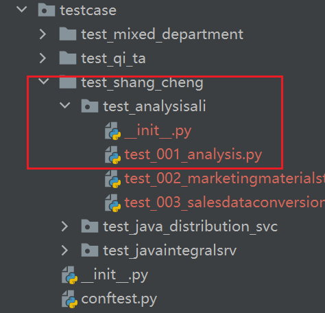
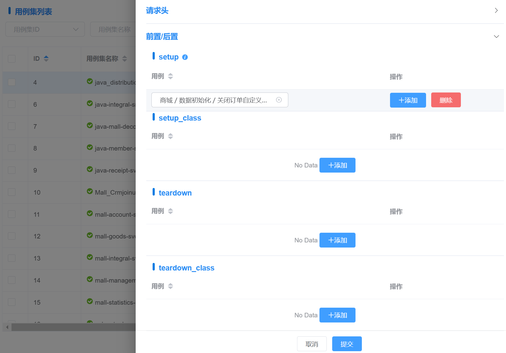
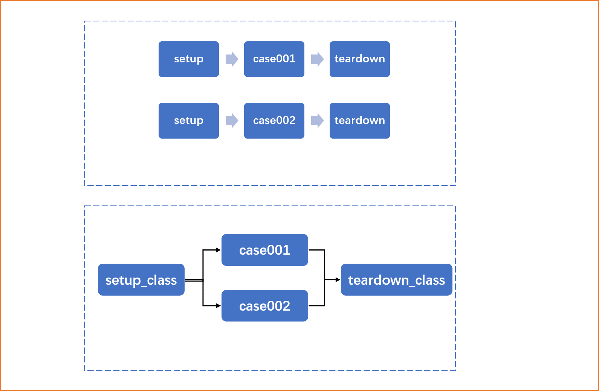

# 用例设计
本篇介绍用例设计注意事项。

## 执行引擎 -- 数据解析
部门 -> 用例集 -> 用例 -> 用例步骤
1. 部门：文件夹
2. 用例集：文件夹
3. 用例：py文件，文件内Class名
4. 步骤：类属性teststeps，数据列表，执行时会遍历执行teststeps

示例：

**商城 -> analysis-ali -> Analysis** 解析后：


``` python
@allure.epic("商城")
@allure.feature("单接口测试")
class TestCaseAnalysis(ApiRunner):
    """统计分析"""
    
    case_id = 3
    config = (
        Config("Analysis")
        .variables(
            **{
                "company_id": {"value": "W00000000226", "description": "公司ID"},
                "base_url_mk": {
                    "value": "https://mk.xxxx.com",
                    "description": "服务商后台地址",
                },
                "base_url_qw": {
                    "value": "https://qw-scrm.xxxx.com",
                    "description": "企微端地址",
                },
                "base_url_oss_bill": {
                    "value": "https://bill.xxxx.com",
                    "description": "运营计费地址",
                },
                "base_url_oss_official": {
                    "value": "https://bill.xxxx.com",
                    "description": "运营官方地址",
                },
                "login_uid": "53",
                "login_name": "王晓博",
                "city": "冬梅市",
                "name": "auto_耿桂珍",
                "name2": "auto_蒋勇",
                "address": "吉林省六盘水县大兴薛路d座 756157",
                "time_stamp": 1638777056,
                "date_now_str": "2021-12-06",
                "phone_number": "13850185278",
                "last_week_date": ["2021-11-29", "2021-12-05"],
                "last_month_date": ["2021-11-01", "2021-11-30"],
                "datetime_now_str": "2021-12-06 15:50:56",
                "last_week_monday": "2021-11-29",
                "last_week_sunday": "2021-12-05",
                "date_month_ago_str": "2021-11-06",
                "date_yesterday_str": "2021-12-05",
                "last_month_end_date": "2021-11-30",
                "last_month_start_date": "2021-11-01",
            }
        )
        .description("统计分析")
        .parent_name("统计分析")
        .base_url("https://mk.xxxx.com")
        .verify(False)
    )
    teststeps = [
        Step(
            RunRequest("staffPermissionGet")
            .with_id(629)
            .with_sid(1)
            .with_description("正常值(员工权限获取)")
            .with_variables(**{})
            .post("/qw-scrm-svc/action/staff/staffPermissionGet")
            .with_params(**{})
            .with_headers(**{})
            .with_cookies(**{})
            .with_data({})
            .with_json({})
            .extract()
            .validate()
            .assert_contained_by("status_code", [200])
            .assert_equal("body.success", True)
        ),
        Step(
            RunRequest("getCustomerSourceAnalysis")
            .with_id(645)
            .with_sid(17)
            .with_description("正常值(客户分析-客户来源分析)")
            .with_variables(**{})
            .post("/qw-scrm-svc/action/report/getCustomerSourceAnalysis")
            .with_params(**{})
            .with_headers(**{})
            .with_cookies(**{})
            .with_data({})
            .with_json({"startTime": 1625068800, "endTime": 1633017599, "type": ""})
            .extract()
            .validate()
            .assert_contained_by("status_code", [200])
            .assert_equal("body.success", True)
        ),
    ]
``` 

## 用例集设计
### 用例集 - 公共请求头
**Headers**
--TODO，有设计数据字段，但是未使用

### 用例集 - 前置后置处理
- 用例集可设置前置/后置操作，对象为setup/teardown类型的测试用例
- 分别配置到setup/setup_class/teardown/teardown_class

- 具体执行策略如下：


## 用例设计
### 用例 - 设置用例变量
JSON格式字符串，作用域为当前用例，供公里下请求步骤调用，如：
```
// 设置：
{"foo1": 1, "foo2": "$var2", "foo3": "${sum(1,3)}"}

// 调用
{"nu": "$foo1", "nu2": "$foo2"}
```

## 步骤设计

### 步骤 - URL扩展
TODO - 暂未实现

主要解决部分url需动态拼接后缀，且格式不统一的场景（请求参数qurey/params传递无法满足测试场景需求）。
::: warning 注意
通过请求参数qurey/params传递能解决的，建议不采用此方法。
:::

::: tip 提示
- 内容为字符串，可以包含**常量、变量、内建函数调用、以及组合拼接**
> 示例：
```
"/?id=1"
"/?id=$user_id"
"/?id=${sum(1,3)}"
"$id=abc${sum(1,3)}"
```
:::


### 步骤 - 请求 - Header
步骤特殊请求header，JSON格式，必须是支持的header内容。默认为空。

### 步骤 - 请求 - Body 
接口请求参数，默认全为空。
1. query: 添加到url的请求字符串中的，用于get请求
2. json: content-type：application/json
3. data：content-type：application/x-www-form-urlencoded（**get请求下data不能用**）

::: tip 提示
- 内容为JSON格式、key-value形式
- value可以包含**常量、变量、内建函数调用、以及组合拼接**，value类型为解析后的值类型。
- 变量来源：
  - 环境参数
  - 环境变量
  - 环境mock数据
  - 全局配置-全局变量
  - 用例变量
- 函数来源
  - python - 内建方法/函数
  - 执行引擎 - 内建方法/函数（见 [附2：内建方法](/api_test/advanced/builtin_functions/)）
> 示例：
```
{"foo1": "常量", "foo2": "$var2", "foo3": "${sum(1,3)}", "foo3": "abc${sum(1,3)}"}
```
:::


### 步骤 - 期望输出
输出响应数据校验。
::: tip 提示
- 内容为JSON格式、key-value形式。key为校验方法，value为{"检查项":"期望值"}
- 支持的校验方法： 见 [附1：数据校验方法](/api_test/advanced/validate_rules/)，如有新需求，请联系我@徐涛
- 检查项
  - 默认为请求body内容，如 {"eq": {"success": true}} 等同于 {"eq": {"body.success": true}}
  - 支持的类型
    - **status_code**，如 {"eq": {"status_code": 200}}
    - **headers**，如 {"eq": {"headers.Content-Type": "application/json; charset=utf-8"}}
    - **cookies**，如 {"eq": {"cookies.xxx": ""}}
    - **body**，如 {"eq": {"body.success": true}}
  - 语法表达式
    - jsonpath表达式，仅支持 **$..** 开头的jsonpath表达式。[语法参考](https://goessner.net/articles/JsonPath/)
    - JMESPATH表达式，非 **$..** 开头的表达式默认以JMESPATH语法解析。[语法参考](https://jmespath.org/tutorial.html)
- 期望值
  - 内容可以是**常量、变量、内建函数调用、以及组合拼接**
> 示例：
```
{"eq": {"status_code": 200}}
{"eq": {"headers.Content-Type": "application/json; charset=utf-8"}}
{"eq": {"cookies.xxx": ""}}
{"eq": {"body.success": true}}
{"eq": {"body.data.id": "$user_id"}}
```
:::


### 步骤 - 变量提取
保存响应结果中的某个元素值为用例变量，供用例中其他后续的测试步骤调用。

::: tip 提示
- 内容为JSON格式、key-value形式。key为保存的**变量名**，value为保存的值
- 保存的值value可以是**常量、变量、内建函数调用、以及组合拼接**，即在测试完成后设置一个变量（非响应提取，一般用于测试过程动态修改用例变量）
- 保存的值value可以是**响应提取表达式**（响应提取）
- 支持的语法表达式
  - jsonpath表达式，仅支持 **$..** 开头的jsonpath表达式。[语法参考](https://goessner.net/articles/JsonPath/)
  - JMESPATH表达式，非 **$..** 开头的表达式默认以JMESPATH语法解析。[语法参考](https://jmespath.org/tutorial.html)
> 示例：
```
{"eq": {"status_code": 200}}
{"eq": {"headers.Content-Type": "application/json; charset=utf-8"}}
{"eq": {"cookies.xxx": ""}}
{"eq": {"body.success": true}}
{"eq": {"body.data.id": "$user_id"}}
```
:::