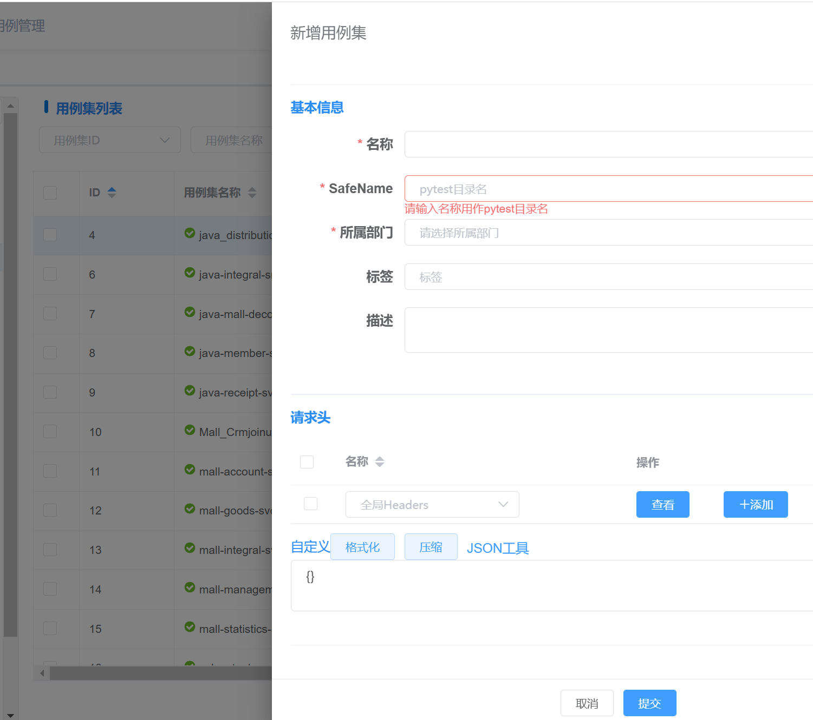
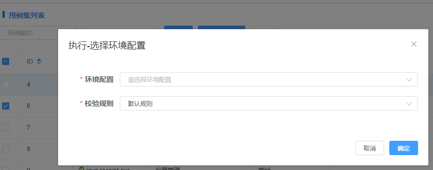
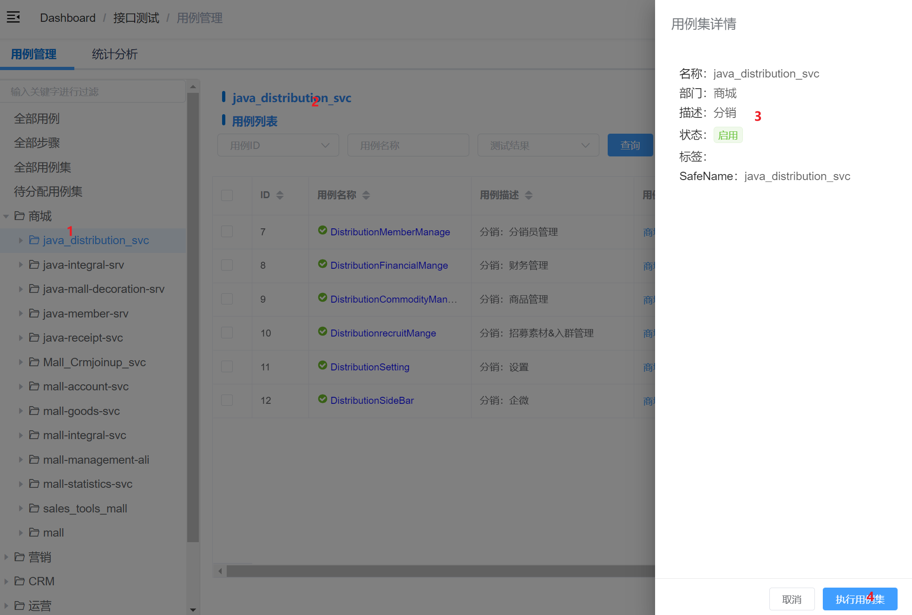
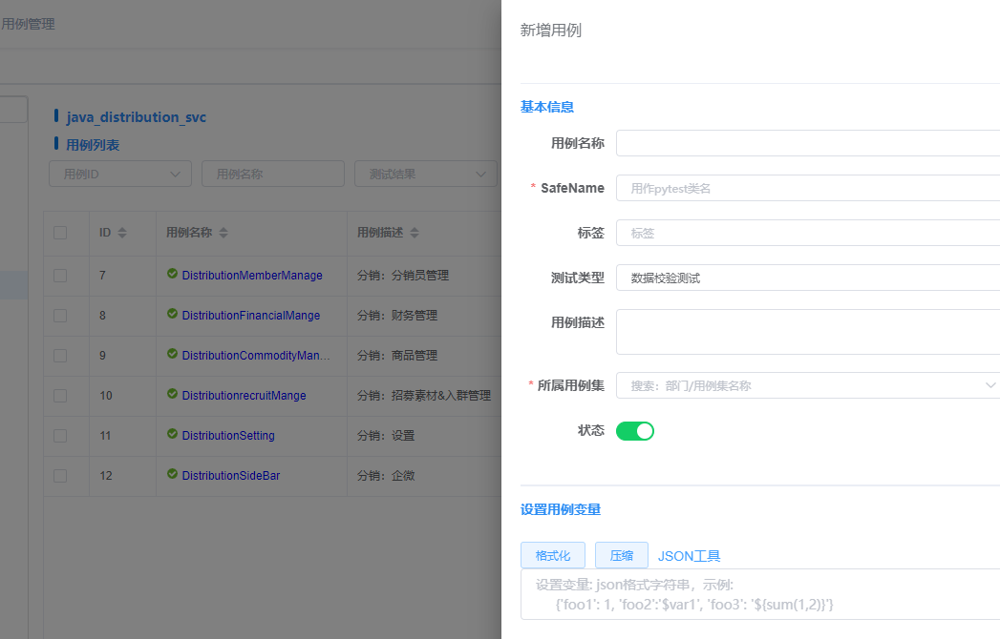
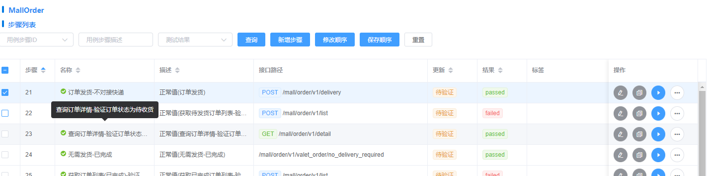
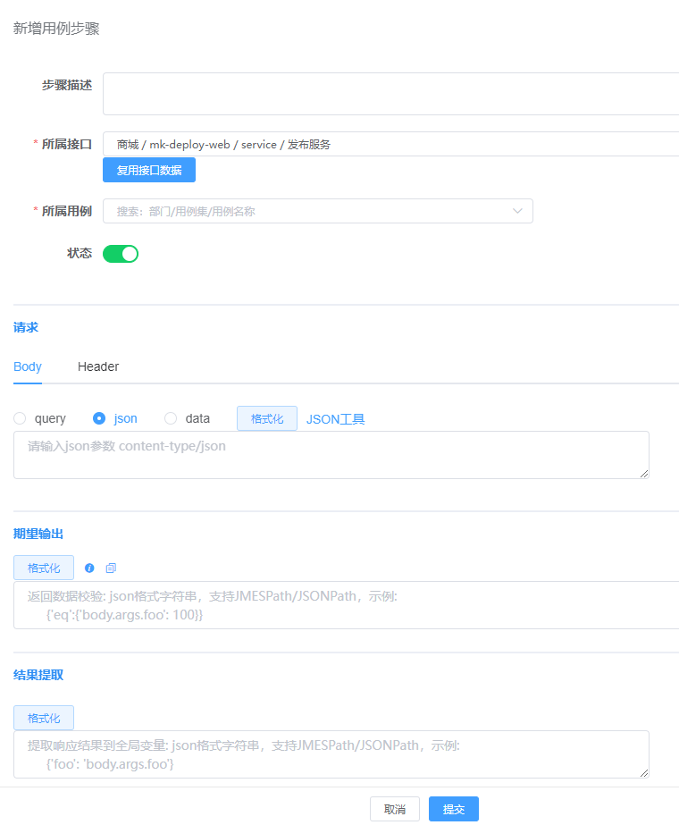

# 用例操作
用例集、用例、用例步骤操作：新增、编辑、删除、复制、执行等。

## 左侧侧边栏
1. 全部用例：点击后右侧显示数据库中**所有用例**列表
2. 全部步骤：点击后右侧显示数据库中**所有步骤**列表
2. 全部用例集：点击后右侧显示数据库中**所有用例集**列表
2. 待分配用例集：点击后右侧显示数据库中所有**未指定部门的用例集**列表，**需要测试人员手动认领处理。**
3. 部门：点击后显示**属于该部门的用例集**列表
4. 部门->用例集：点击后显示**属于该用例集的用例**列表
5. 部门->用例集->用例：点击后显示**属于该用例的步骤**列表

## 用例集
### 用例集 - 新增
> 名称
>
> SafeName: 请输入名称用作pytest测试用例py文件的目录名，如果中文会被转换为拼音，其他字符会被转换为下划线。
> 
> 所属部门：必选，测试执行时需要将用例集归属到对应部门文件夹
> 
> 标签：标识测试用例集的label，方便后期筛选
> 
> 请求头：应用于所有测试集下的请求头  -- TODO

### 用例集 - 编辑
同上

### 用例集 - 执行
执行选中测试用例集。-- 需选中指定环境配置、校验规则

### 用例集 - 删除
软删除

### 用例集 - 批量处理
1. 运行
2. 编辑 - 批量编辑所属部门
3. 启用、禁用
4. 删除

### 用例集 - 详情
点击左侧树目录用例集名称 -> 右侧显示用例集+用例集下的用例列表 -> 点击右侧顶部用例集名称 ->显示用例集详情抽屉页。

抽屉页显示用例集详情、**执行用例集**按钮

## 用例
点击用例集，显示对应用例集下的所有用例列表。

### 用例 - 新增
> 名称
>
> SafeName: 请输入名称用作pytest测试Class名，如果中文会被转换为拼音，其他字符会被去掉。
> 
> 所属用例集：必选，测试执行时需要将用例归属到对应用例集文件夹
> 
> 标签：标识测试用例的label，方便后期筛选
> 
> 测试类型：必选，对测试用例的测试类型标识
> 
> 设置用例变量：**JSON格式数据**，设置作用域仅当前用例的全局变量，供用例步骤设计时使用。

### 用例 - 编辑
同上，编辑基本信息。

### 用例 - 复制
同上，复制当前用例为一条新数据。

### 用例 - 执行
执行选中测试用例。-- 需选中指定环境配置、校验规则。

### 用例 - 删除
软删除。

### 用例 - 批量处理
1. 运行
2. 编辑 - 批量编辑所属用例集
3. 启用、禁用
4. 删除

### 用例 - 详情
点击左侧树目录用例名称 -> 右侧显示用例+用例下的步骤列表 -> 点击右侧顶部用例名称 ->显示用例详情抽屉页。

抽屉页显示用例详情、**执行用例**按钮

## 测试步骤
点击用例，显示对应用例集下的所有测试步骤列表。

### 步骤 - 列表
步骤字段详细信息，点击接口路径 -> 显示对应接口详细信息。

### 步骤 - 新增
> 名称
>
> 所属接口：必选，请求指定接口
1. 点击**复用接口数据**可复制接口用例模板到当前步骤
2. 鼠标放置**复用接口数据**后面的**接口名称**，显示接口基本信息：接口、描述、地址（method+path）
3. 点击**复用接口数据**后面的**接口名称**，页面跳转到接口详情
> 
> 所属用例：必选，测试执行时需要将测试步骤归属到对应用例Class下
> 
> 标签：标识测试测试步骤的label，方便后期筛选
> 
> 请求：Body(query\json\data)、header，**JSON格式数据**
> 
> 期望输出：**JSON格式数据**
> 
> 结果提取：**JSON格式数据**

### 步骤 - 编辑
同上，编辑基本信息。

### 步骤 - 复制
同上，复制当前步骤为一条新数据。

### 步骤 - 执行
执行选中测试步骤。-- 需选中指定环境配置、校验规则。

### 步骤 - 删除
软删除。

### 步骤 - 批量处理
1. 运行
2. 编辑 - 批量编辑所属用例
3. 启用、禁用
4. 删除

### 步骤 - 修改顺序
拖动修改测试步骤顺序。
::: warning 注意：
顺序拖动修改只能在当前页修改，如果需要跨页拖动顺序，可以通过底部工具栏修改page_size使列表在一页显示，再做修改。
:::

