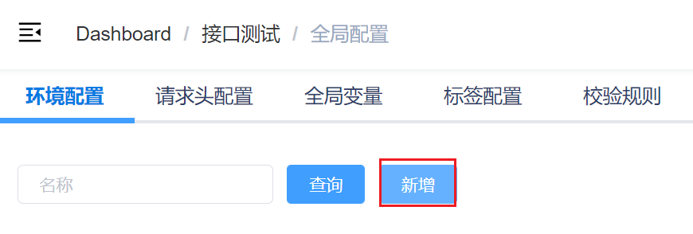
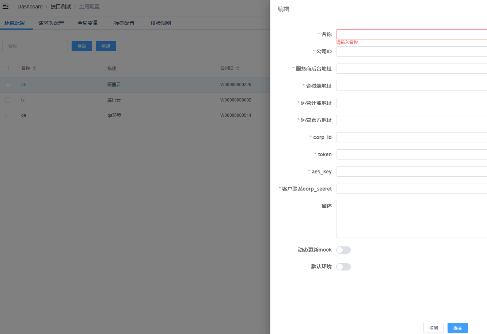
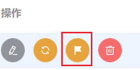
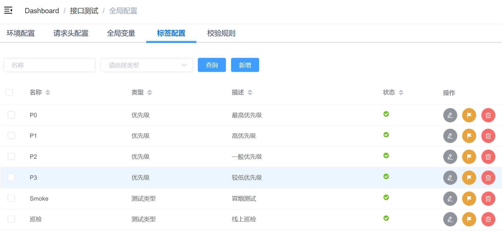
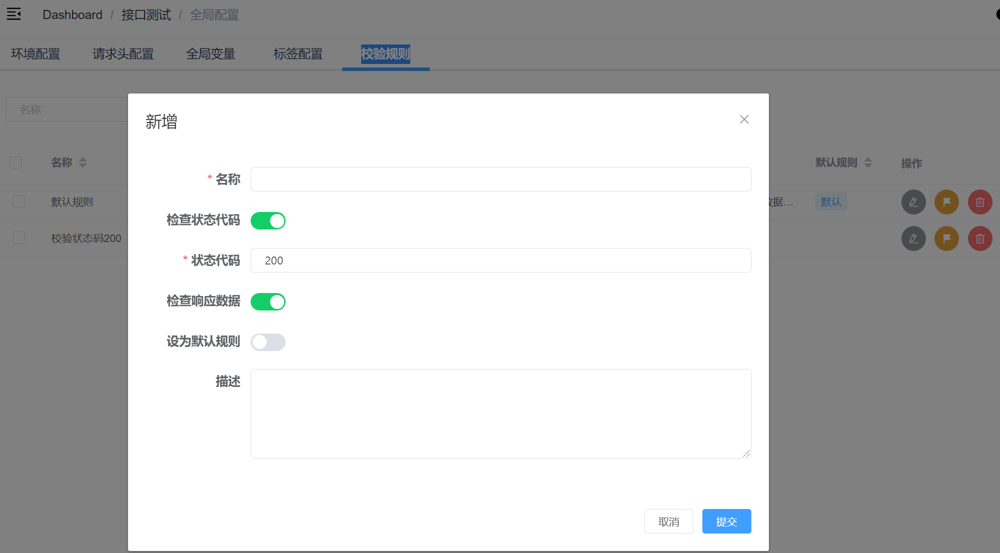
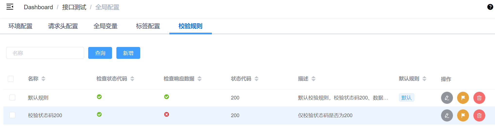

# 全局配置
全局环境、参数、配置管理

::: warning 注意：
**环境配置** 和 **校验规则** 都需要配置至少一个，测试执行时需要用到
:::

## 环境配置
配置测试环境参数，供执行测试时选择，**至少配置一个**

### 新建环境
全局配置->环境配置：点击新增，进入新建环境页面


在新建配置页，填写配置信息：

> 名称：不要重复，标识清晰确保自己能辨识。
> 
> 描述：环境描述
> 
> 公司ID：环境对应公司ID号，如：W00000000226
> 
> 服务商后台地址，如：https://mk.xxxx.com
> 
> 企微端地址，如：https://qw-scrm.xxxx.com
> 
> 运营计费地址，如：https://bill.xxxx.com
> 
> 运营官方地址，如：https://bill.xxxx.com
> 
> corp_id：
> 
> token：
> 
> aes_key：
> 
> 客户联系corp_secret：企微回调，客户联系的应用corp_secret
>
> 动态更新mock：true - 每次测试执行时会重新更新mock数据，false - 直接使用已有mock数据
> 
> 默认环境: 设置为默认（true），测试执行时作为默认选择项



### 编辑环境配置
表单字段修改同上


### 更新环境数据
1. 根据配置的环境参数，自动获取改环境的一系列环境数据，作为全局变量被测试用例/步骤设计使用。
2. 更新mock数据，作为全局变量被测试用例/步骤设计使用。


### 禁用/启用
禁用后，测试执行->环境选择: 不能作为选择项显示。



### 删除
删除项为软删除，数据库表中自动is_deleted被设置为true，如果需要恢复，可以手动从数据库修改。


## 请求头配置
配置全局请求头，方便用例设计时直接选用，减少重复填写相同请求头。

### 新增全局请求头
> 名称：全局请求头名称标识
> 
> 描述：全局请求头内容描述
> 
> 内容：JSON字符串格式，key:value，key需要是支持的请求头，如：“User-Agent”。内容示例：
``` js
{"User-Agent":"Mozilla/5.0 (Macintosh; Intel Mac OS X 10_14_0) AppleWebKit/537.36 (KHTML, like Gecko) Chrome/88.0.4324.192 Safari/537.36"}
```

## 全局变量
> 名称：全局变量名，如：user_id
> 
> 描述：全局变量描述，如：用户ID
> 
> 内容：变量值
> 
> 类型：TODO

## 标签配置
全局标签统一灵活配置，供用例设计选择。
应用场景如：
1. smoke标签用例筛选，执行冒烟测试。
2. 优先级标签P0、P1、P2标识，筛选执行。
3. 测试类型标签：统计分析筛选标准，统计不同类型用例。
4. 功能标签：标识用例所属功能点，后期可与 **精准测试** 基于功能点关键字进行联动。




## 校验规则
配置全局校验规则，供测试执行时选用**至少配置一个**

在新建校验规则页，填写配置信息：
> 名称，如：默认规则
> 
> 描述
> 
> 检查状态代码：true - 接口请求完成后统一检查状态码是否为预期
> 
> 状态代码：期望状态码，如有多个，用英文逗号隔开，判断：响应状态码是否为期望列表中之一，如：”200“， “200，201”
> 
> 检查响应数据：是否检查用例设计中填写的响应数据校验， true - 是， false - 否
> 
> 设为默认规则：是否设置为默认规则，默认规则在测试执行时默认被选中（可选中修改）



示例：


