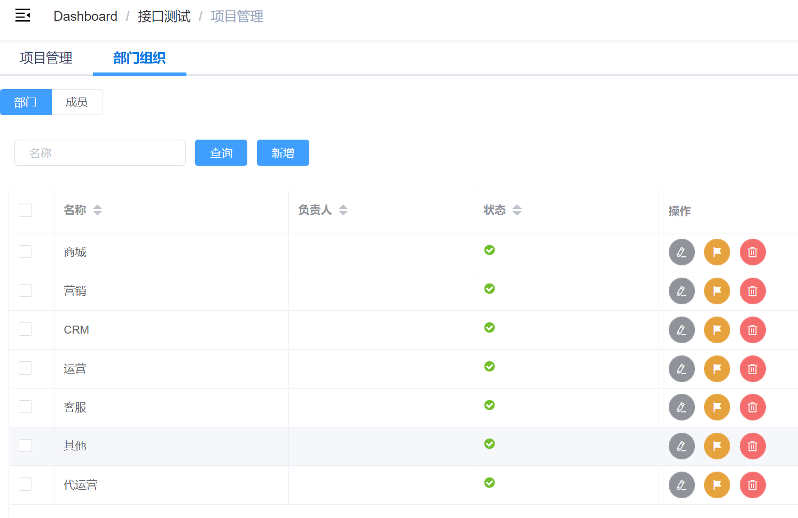
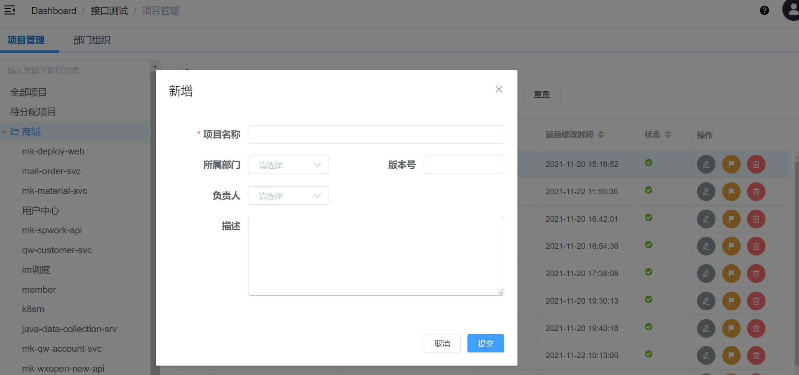

# 项目管理
接口项目管理结构：部门 -> 项目 -> 接口分组 -> 接口列表。

将接口统一管理到不同的项目、部门下，通过配置部门负责人、项目负责人、抄送人等信息，
当接口测试遇到故障时，实现故障解决联系人、通知人的精确匹配。

## 部门组织
统一配置部门组织架构，关联部门负责人信息。

## 项目管理

### 左侧侧边栏
1. 树目录懒加载实现，默认只展开：全部项目、待分配项目、部门，点击尖角符展开。
2. 关键字过滤： 对树目录进行关键字过滤，注意：只能过滤已有的树目录，即一次都未展开过则不在树目录下。 
3. 全部项目：数据库中所有项目，支持按项目名称、所属部门进行过滤查询。
4. 待分配项目：所属部门未空的项目，**需要各部门测试人员认领**。
5. 点击部门名：右侧显示属于该部门的所有项目。
6. 点击部门下项目名：跳转 **项目详情->项目概况**

### 项目列表
1. 显示满足条件查询的项目列表信息。
2. 左侧选择框可多选、全选 -> **批量处理： 删除**
3. 项目名称：链接，跳转路由到 **项目详情->项目概况**

### 新增项目
> 项目名称
> 
> 所属部门: 下拉选择，如果没有期望的选项，联系管理员添加
> 
> 版本号：字符串，如v1，v2
> 
> 负责人： 下拉选择User，如没有期望的选项，联系管理员添加

### 编辑项目
同上

### 分页
列表分页显示，可选择每页数量

## 项目详情
显示项目详细信息，包含：项目概况、统计分析、成员管理、项目动态

### 项目概况

### 统计分析
统计当前项目的接口： 覆盖率、更新信息，页面同**接口管理->统计分析**

### 成员管理
项目成员管理，配置成员即联系方式。

### 项目动态
记录当前项目的修改动态
