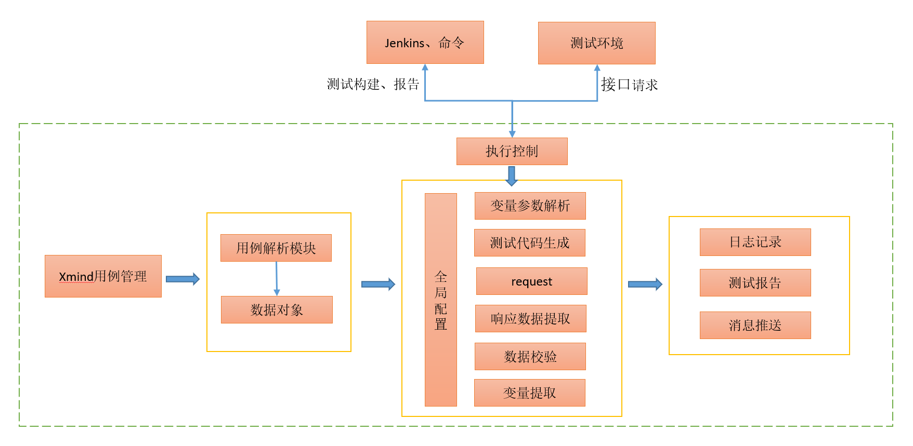

# 背景

## 为什么要做接口测试？
- 黑盒测试回归效率低；
- 回归的覆盖率不足；
- 手动测试的偶然性和不确定性；
- 系统越复杂，问题越多

## 平台开发背景
在开始本项目前，我已经写了一个轻量化的接口测试框架，并在团队中推广使用。（V1版）

这是一个xmind管理、设计接口测试用例，执行框架读取用例数据并以数据驱动去执行用例。

V1版接口测试框架设计：

### 优点
- 简单灵活
- Xmind思维导图用例设计效率高，方便测试用例评审

### 缺点
- 大量接口的情况，管理困难
- 接口变更频繁，用例维护成本高
- 接口覆盖率、用例执行情况等难以统计
- 场景测试步骤复用困难
- 更偏向于一款工具，测试执行后即完成
