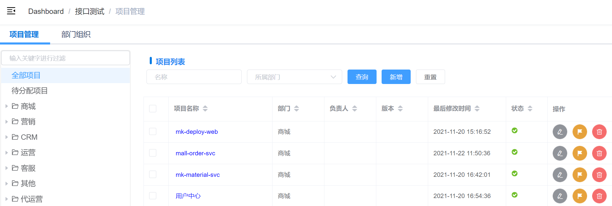

# 开始第一个测试
这里简单介绍快速开始一个测试的基本流程。

## 步骤1：添加接口到测试平台
如果不需要新增接口，跳过此步骤。
1. 项目管理->新建项目（如无），指定项目所属部门（如无，创建部门）

2. 接口管理->新建接口，指定接口所属项目、分组（如无，新建）

## 步骤2：添加测试全局配置
1. 创建环境配置：填写必填项，测试执行时需要选择

2. 创建校验规则：至少1个，测试执行时需要选择

## 步骤3：新建测试用例
如果不需要新增用例，跳过此步骤。
1. 新建测试用例集，需选择所属部门
2. 新建测试用例，需选择所属用例集
3. 新增测试步骤，需选择所属用例，关联接口（可复用接口信息中的用例模板）

## 步骤4：测试执行
可以多种方式执行测试：
1. 用例管理页面选择 指定用例集/用例/步骤直接执行
2. 用例管理页面选择 多条用例集/用例/步骤直接执行
3. 工作台页面选择测试执行（全量执行、冒烟测试、业务巡检测试） --TODO

## 步骤5：查看测试报告
执行完毕后，在历史报告页面查看报告。
1. 结果统计：默认维度为测试步骤，可选择“用例”查看以测试用例为维度的统计结果。
2. 测试报告
   1. pytest：pytest-html生成的报告，内容较简洁，颗粒度为 测试用例，
   2. allure：allure-pytest生成的报告，内容较丰富，颗粒度为 测试步骤，且包含步骤请求、响应、结果校验、变量提取等详细信息。
   3. Log：执行当前测试时的全量日志信息。
