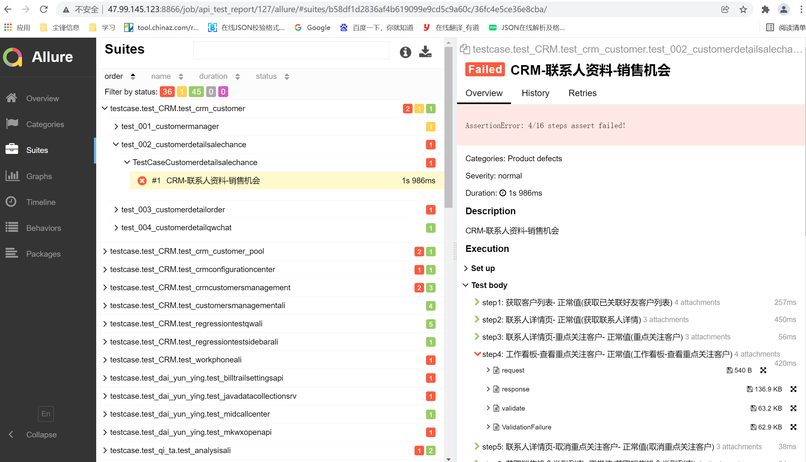
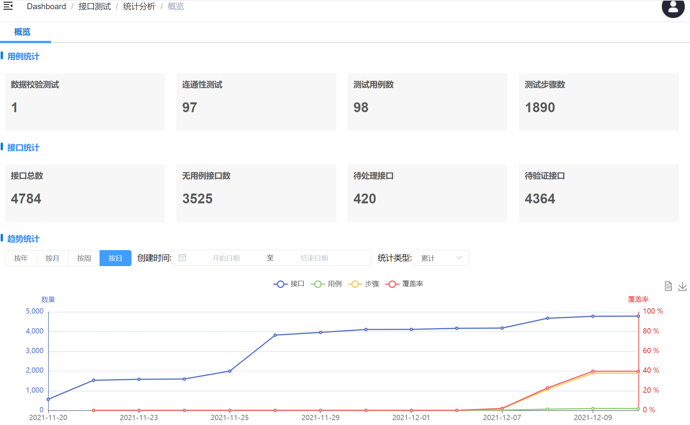

# 快速上手
在开始使用之前，我们先来熟悉一下 测试平台-接口测试 的网站结构，这将让你快速了解各模块功能。

## 地址
[https://qalab.xxxx.com/](https://qalab.xxxx.com/)

## 登录、注册
TODO

## 工作台
TODO

## 全局配置
1. 环境配置: 配置测试环境参数，供执行测试时选择，**至少配置一个**

2. 请求头配置: 全局请求头配置，供用例设计时继承
3. 全局变量: 配置全局变量，用例设计时直接使用（读或写）
4. 标签配置: 标签管理，类型：优先级、严重等级、测试类型

5. 校验规则: 数据校验通用规则，**至少配置一个**

::: warning 注意：
环境配置和校验规则至少配置一个，测试执行时需要用到
:::

## 项目管理
1. 部门组织：管理部门，设置负责人；管理成员，设置成员联系方式
2. 项目管理：项目分属不同部门，未分配到部门的项目需手动领取；项目成员管理，添加移除成员
3. 项目下包含：接口分组->接口

## 接口管理
1. 接口按 部门->项目->分组管理，实现接口新增、维护，接口用例模板维护，接口覆盖率、接口更新统计分析
2. 统计分析 -》 接口覆盖率：统计数据、未覆盖的接口列表，便于快速精准设计用例
3. 统计分析 -》 接口更新：统计数据、存在更新的待处理接口列表，便于快速精准维护用例
4. 数据同步：接收到的YAPI hook消息事件，待更新同步
5. 查重工具：接口查重处理  -- TODO

## 用例管理
用例按 部门->用例集->用例->步骤 进行管理，实现用例设计、执行

## 历史报告
历史报告列表显示执行历史，统计每次测试结果，并提供link链接到对应测试报告详情、日志详情。

allure报告包含比较详细的报告内容：用例、步骤、步骤请求、步骤响应、步骤结果校验、步骤变量提取、统计等。

## 数据管理
实现数据导入和导出，数据备份。
目前支持xmind旧用例导入，可重复导入（去重更新）

## 任务管理
TODO

## 统计分析
数据统计、分析，包含接口、用例、步骤，按不同维度分析用例设计质量，用例执行效果，覆盖率进度预测等。
### 概览
数据统计概览，总趋势分析
- 用例统计
  - 用例数、步骤数
  - 测试类型统计：单接口测试用例数、场景测试数、性能测试用例数...
- 接口统计
  - 接口总数、无用例接口数、更新待处理接口、更新待验证接口
- 趋势统计
按时间统计接口、用例、步骤、覆盖率的变化趋势。
  - 统计维度：年、月、周、日
  - 统计类型：累计、新增
  - 时间筛选

### 接口分析
1. 分析接口待覆盖、更新待处理数量，分属哪些项目、分属哪些部门。
2. 分析接口执行结果，统计性能差接口、故障多接口（所属部门？）

### 用例分析
对测试用例、用例步骤进行分析

1. 测试分类统计、百分比：单接口测试、场景测试、性能测试 
2. 测试执行率分析：统计被执行率，分析出经常被阻塞的用例/步骤 
3. 测试结果分析

### 进度预测
在接口、用例同时新增的状态下，预测接口覆盖率达到100%需要的时间。